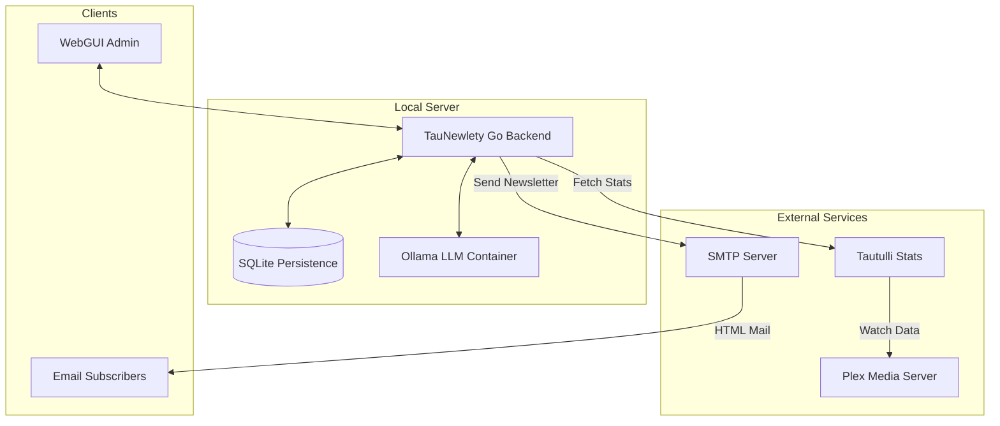

# 🎬 TauNewlety v0.1
> **The Ultimate AI-Powered Plex Media Server Companion**

[](https://go.dev/)
[](https://github.com/arumes31/taunewlety/actions)
[](https://github.com/arumes31/taunewlety/actions)
[](LICENSE)
[](https://github.com/arumes31/taunewlety/pkgs/container/taunewlety)

TauNewlety is a high-performance Go application that transforms your Plex Media Server into an engaging, interactive experience. By combining **Tautulli** watch data with local **AI (Ollama)**, it generates beautiful, personalized daily newsletters for your users.

---

## 🏗 Architecture


---

## ✨ Features

### 🧠 Intelligent Recommendations
- **AI-Generated Content**: Uses **Llama 3.2 (3B)** locally to write catchy, engaging movie/series descriptions.
- **Smart Mixing**: Balances "Critically Acclaimed", "Trending", "Based on Library Taste", and "Fresh Discoveries".
- **Stage-Based Fallback**: Always finds something to recommend by relaxing filters if new content is scarce.
- **Surprise Me!**: Includes a random "Wildcard" recommendation to keep things exciting.
- **Blacklist logic**: Automatically blocks recommended items for 7 days to prevent repetition.

### 🖥️ Modern Web Management
- **Full Settings Dashboard**: Configure Plex, Tautulli, SMTP, and AI settings directly in the browser.
- **Subscriber Management**: Add, remove, and monitor email subscribers.
- **System Stats**: Real-time tracking of AI token usage and delivery history.
- **Live Logs**: Transparent view of internal system events and LLM generation.
- **Newsletter Preview**: See exactly what your users will receive before sending.

### 🛡️ Security & Privacy
- **Secure Unsubscribe**: Confirmation flow protected by math-based **Captcha**.
- **Local AI**: No data leaves your server; all generation happens locally on your CPU.
- **Hardened Server**: Built-in Slowloris protection and secure session management.
- **Containerized**: Runs securely in isolated Docker containers.

---

## 🚀 Quick Start

### 1. Requirements
- Docker & Docker Compose
- A Tautulli instance linked to your Plex server

### 2. Configuration
Create a `.env` file from the example:
```bash
cp .env.example .env
```
Edit `.env` and set your secure login credentials:
```env
APP_USER=admin
APP_PASS=your_secure_password
SESSION_SECRET=a_very_long_random_string
```

### 3. Launch
```bash
docker-compose up -d
```
> **Note**: On the first run, the Ollama container will automatically pull the **Llama 3.2 (3B)** model (approx. 2GB). This may take a few minutes depending on your internet speed.

### 4. Setup
Open `http://localhost:8080`, log in, and navigate to **Settings** to provide your Tautulli and SMTP details.

---

## 🛠 Tech Stack
- **Backend**: Go 1.26 (Standard Layout)
- **Frontend**: Vanilla CSS & HTML Templates (No external CDNs)
- **Database**: SQLite (GORM)
- **AI**: Ollama (Llama 3.2:3b)
- **CI/CD**: GitHub Actions (Multi-arch, Security Scanned)

---

## 📂 Project Structure
Following Go best practices:
- `/cmd`: Entry points
- `/internal/api`: Web handlers
- `/internal/domain`: Business models
- `/internal/platform`: Database & Clients
- `/internal/service`: Core business logic
- `/deployments`: Docker configurations
- `/web`: Static assets & Templates

---

## 🤝 Contributing
Contributions are welcome! Please check the `v2_test` branch for the latest work.

---

## 📄 License
This project is licensed under the MIT License - see the [LICENSE](LICENSE) file for details.
