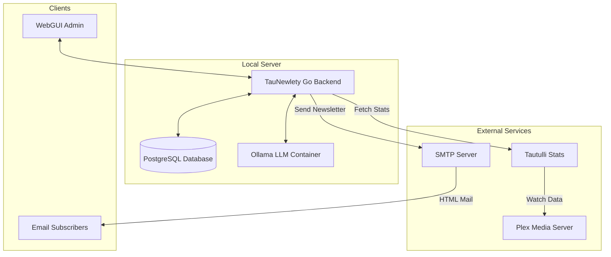

# 🎬 TauNewlety v0.1
> **The Ultimate AI-Powered Plex Media Server Companion**

[](https://go.dev/)
[](https://github.com/arumes31/taunewlety/actions)
[](https://github.com/arumes31/taunewlety/actions)
[](LICENSE)
[](https://github.com/arumes31/taunewlety/pkgs/container/taunewlety)

**About:** TauNewlety is a high-performance Go application that transforms your Plex Media Server into an engaging, interactive experience. By combining **Tautulli** watch data with local **AI (Ollama)**, it generates beautiful, personalized daily newsletters for your users.

**Tags:** `plex`, `tautulli`, `ollama`, `llm`, `newsletter`, `golang`, `docker`, `self-hosted`, `media-server`, `ai-recommendations`

---

## 🏗 Architecture


---

## ✨ Features

### 🧠 Intelligent Recommendations
- **AI-Generated Content**: Uses **Llama 3.2 (3B)** locally to write catchy, engaging movie/series descriptions.
- **Smart Mixing**: Balances "Critically Acclaimed", "Trending", "Based on Library Taste", and "Fresh Discoveries".
- **Stage-Based Fallback**: Always finds something to recommend by relaxing filters if new content is scarce.
- **Surprise Me!**: Includes a random "Wildcard" recommendation to keep things exciting.
- **Blacklist logic**: Automatically blocks recommended items for 7 days to prevent repetition.

### 🖥️ Modern Web Management
- **Full Settings Dashboard**: Configure Plex, Tautulli, SMTP, and AI settings directly in the browser.
- **Subscriber Management**: Add, remove, and monitor email subscribers.
- **System Stats**: Real-time tracking of AI token usage and delivery history.
- **Live Logs**: Transparent view of internal system events and LLM generation.
- **Newsletter Preview**: See exactly what your users will receive before sending.

### 🛡️ Security & Privacy
- **Secure Unsubscribe**: Confirmation flow protected by math-based **Captcha**.
- **Local AI & Data Privacy**: No data leaves your server; subscriber emails are strictly sanitized and omitted from system logs.
- **Cryptographically Secure Randomization**: Uses `crypto/rand` for unguessable "Surprise Me" recommendations.
- **Hardened Server**: Built-in Slowloris protection, secure session management, and audited against Gosec & Govulncheck.
- **Containerized**: Runs securely in isolated Docker containers with a dedicated PostgreSQL backend.

---

## 🚀 Detailed Setup Guide

### 1. Prerequisites
- **Docker & Docker Compose**: Installed and running on your host.
- **Tautulli**: Installed and linked to your Plex server.
- **SMTP Server**: An account with a provider (Gmail, Mailgun, etc.) or a self-hosted instance to send emails.

### 2. Prepare Environment
Create a `.env` file in the project root:
```bash
cp .env.example .env
```
Set the following mandatory variables:
- `APP_USER`: Your dashboard username.
- `APP_PASS`: Your dashboard password.
- `SESSION_SECRET`: A long random string.
- `DB_USER`, `DB_PASSWORD`, `DB_NAME`: Credentials for the PostgreSQL container.

### 3. Deploy with Docker Compose
Run the stack in the background:
```bash
docker-compose --env-file .env -f deployments/docker/docker-compose.yml up -d
```
`--env-file` is required: with `-f` pointing at another directory, Compose looks for `.env` next to the Compose file rather than in the project root, and startup fails on the required `APP_PASS`/`DB_PASSWORD` variables.
This will start:
1.  **TauNewlety**: The main application logic.
2.  **PostgreSQL**: Persistent relational data store.
3.  **Ollama**: The local AI engine (will automatically pull `llama3.2:3b` on first start).

### 4. Application Configuration
1.  Access the dashboard at `http://127.0.0.1:8080`. The Compose file binds the
    app to loopback on purpose — see [Production Deployment & TLS](#-production-deployment--tls)
    for exposing it safely over HTTPS.
2.  Log in using the credentials set in `.env`.
3.  Go to **Settings** and configure:
    -   **Tautulli**: URL and API Key (found in Tautulli Settings > Web Interface).
    -   **Plex**: URL and Token (used for resolving media metadata if needed).
    -   **SMTP**: Server address, port, username, and password.
    -   **AI**: Ensure the Ollama URL matches the service name in docker-compose (`http://ollama:11434`).

### 5. Managing Subscribers
Navigate to the **Subscribers** tab to add email addresses manually. Users can unsubscribe at any time via the link at the bottom of each newsletter.

### 6. Automated Schedule
The application includes a built-in scheduler. You can define the delivery time in the **Settings** dashboard (Newsletter Time field, HH:MM 24h format). The cron schedule is automatically derived from this setting.

---

## 🔒 Production Deployment & TLS

### Option A: Reverse Proxy (Recommended)

For production, it is **strongly recommended** to use a reverse proxy for TLS termination rather than exposing the Go server directly. This provides better security, certificate management, and HTTP/2 support.

The upstream address depends on where the proxy runs:

- **Proxy installed on the host** → `127.0.0.1:8080`, the address the Compose file publishes.
- **Proxy running as a Compose service** → `app:8080`, resolved over the shared Docker network. In this case also remove the `ports` mapping from the `app` service, so the container is reachable only from inside the network.

The examples below use the host form; swap the upstream for `app:8080` when the proxy is a Compose service.

#### Nginx Example

```nginx
server {
    listen 443 ssl http2;
    server_name taunewlety.example.com;

    ssl_certificate     /etc/letsencrypt/live/taunewlety.example.com/fullchain.pem;
    ssl_certificate_key /etc/letsencrypt/live/taunewlety.example.com/privkey.pem;

    # Modern TLS configuration
    ssl_protocols TLSv1.2 TLSv1.3;
    ssl_ciphers HIGH:!aNULL:!MD5;
    ssl_prefer_server_ciphers on;

    location / {
        # Compose service instead of host install: http://app:8080
        proxy_pass http://127.0.0.1:8080;
        proxy_set_header Host $host;
        proxy_set_header X-Real-IP $remote_addr;
        proxy_set_header X-Forwarded-For $proxy_add_x_forwarded_for;
        proxy_set_header X-Forwarded-Proto $scheme;
    }
}
```

#### Caddy Example

Caddy provides automatic HTTPS via Let's Encrypt:

```
taunewlety.example.com {
    # Compose service instead of host install: reverse_proxy app:8080
    reverse_proxy 127.0.0.1:8080
}
```

The Compose file publishes the app on `127.0.0.1:8080` rather than `0.0.0.0:8080`, so the only route in from the network is through your proxy.

### Option B: Direct TLS

If you prefer to skip the reverse proxy, TauNewlety can serve TLS directly. Set both environment variables:

```bash
TLS_CERT=/path/to/cert.pem
TLS_KEY=/path/to/key.pem
```

When both `TLS_CERT` and `TLS_KEY` are set, the server starts with `ListenAndServeTLS` instead of plain HTTP. This is suitable for simple deployments but lacks features like automatic certificate renewal that a reverse proxy provides.

Under Docker Compose, the paths must point *inside* the container. Put the certificate and key in `deployments/docker/certs/`, uncomment the read-only mounts in the `app` service of `docker-compose.yml`, and set the container paths in `.env`:

```bash
TLS_CERT=/certs/cert.pem
TLS_KEY=/certs/key.pem
```

The container healthcheck follows the same switch, probing `https://localhost:$PORT/health` whenever both variables are set.

> **Important**: Never expose the application over plain HTTP in production. Always use HTTPS/TLS to protect session cookies and credentials.

---

## 🛠 Tech Stack
- **Backend**: Go 1.27 (Standard Layout)
- **Frontend**: Vanilla CSS & HTML Templates (No external CDNs)
- **Database**: PostgreSQL (GORM)
- **AI**: Ollama (Llama 3.2:3b)
- **CI/CD**: GitHub Actions (Multi-arch, Security Scanned)

---

## 📂 Project Structure
Following Go best practices:
- `/cmd`: Entry points
- `/internal/api`: Web handlers
- `/internal/domain`: Business models
- `/internal/platform`: Database & Clients
- `/internal/service`: Core business logic
- `/deployments`: Docker configurations
- `/web`: Static assets & Templates

---

## 🤝 Contributing
Contributions are welcome! Please check the `v2_test` branch for the latest work. Ensure all new code includes unit tests (aiming for 100% coverage).

Security reports should follow [SECURITY.md](SECURITY.md) and must not be filed
as public issues.

---

## 📄 License
This project is licensed under the MIT License - see the [LICENSE](LICENSE) file for details.
